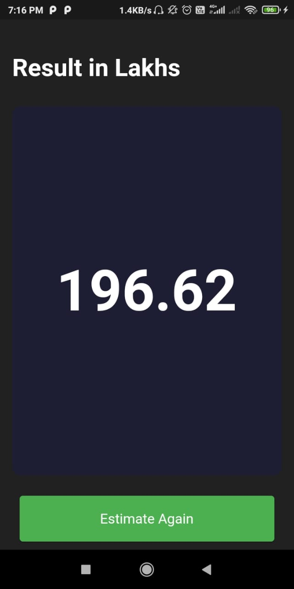

# Bangalore House Price Predictor App 
Made a Home Price predictor app for Bangalore. Used kaggle's [bengaluru house price dataset](https://www.kaggle.com/amitabhajoy/bengaluru-house-price-data) applied the concept of regression  after basic Data cleaning. User can input area, bathrooms, BHK and Location and then get the Prediction.

 

# 💻Tech Stack Used
- Data Science 
- Frontend - Flutter
- Server - Flask

 

# Working 

### ⚡ Screenshots
 

    </img>=> </img> 

 
 

